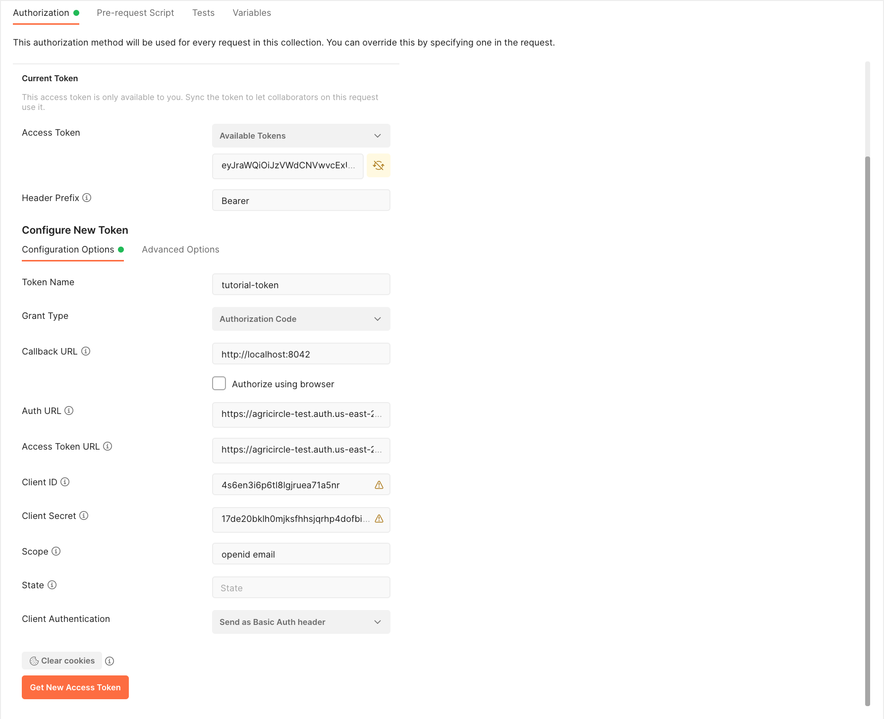
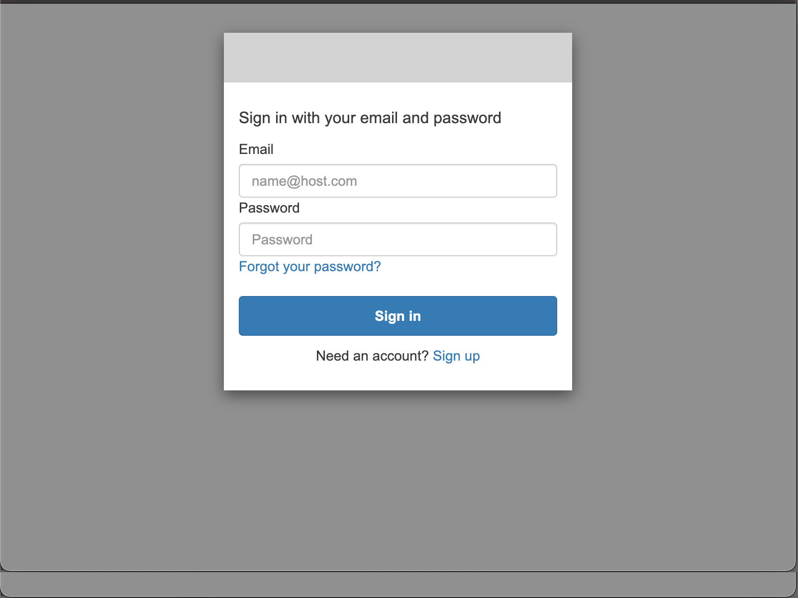
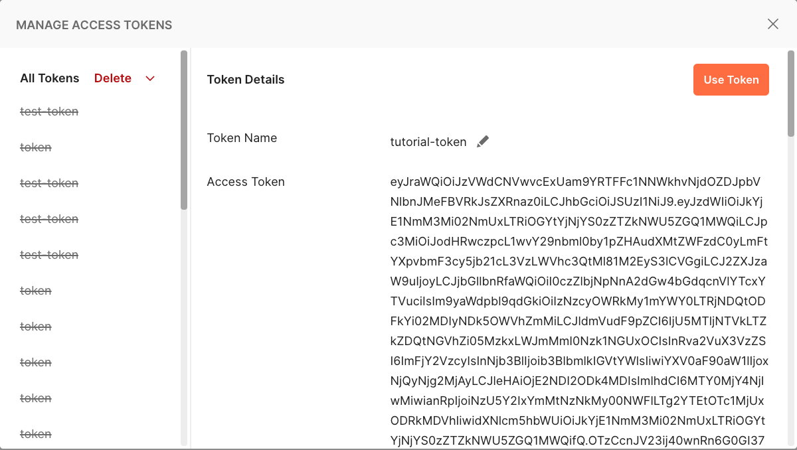

# Tutorial on Oauth2/OIDC authorization code flow authentication with AWS Cognito

In this tutorial, we will setup an authentication server from scratch using AWS Coginto (free tier).

We will also create a minimalistic web service (in python) and show how to integrate it with the authentication server to protect specific endpoints.

## Some background

### Why OAuth2?
The OAuth 2.0 authorization framework enables a third-party
application to obtain limited access to an HTTP service, either on
behalf of a resource owner by orchestrating an approval interaction
between the resource owner and the HTTP service, or by allowing the
third-party application to obtain access on its own behalf

### What is Oauth2 code grant flow authentication?

Authorization code flow is used to obtain an access token to authorize API requests. Authorization code flow is the most flexible of the three supported authorization flows and is the recommended method of obtaining an access token for the API. This authorization flow is best suited to applications that have access to secure, private storage such as web applications deployed on a server.

### What is OIDC?

OIDC is a thin layer that sits on top of OAuth 2.0 that adds login and profile information about the person who is logged in.

Basically it defines the format and attributes of the authentication token obtained by OAuth2.

### References:
[IETF RFC6749](https://datatracker.ietf.org/doc/html/rfc6749) - the OAuth 2.0 Authorization Framework

[IETF RFC6750](https://www.ietf.org/rfc/rfc6750.txt)  - the OAuth 2.0 Authorization Framework: Bearer Token Usage

## Setup an authentication server in AWS Cognito

pre-requisites: you must have an AWS account

### Create a Cognito User Pool

[Sign-in to AWS](https://us-east-2.console.aws.amazon.com/console/home) and select "Cognito" in "Services" dropdown or [go straight to Cognito](https://us-east-2.console.aws.amazon.com/cognito/home)  
Click "Create User Pool"

#### Step 1 - Configure sign-in experience
Check "email" box as sign-in option (for example)  
Leave default values for everything else  
Click "Next"

#### Step 2 - Configure security requirements
Select MFA Enforcement = "No MFA"
Leave default values for everything else  
Click "Next"

#### Step 3 - Configure sign-up experience
Leave default values for everything  
Click "Next"

#### Step 4 - Configure message delivery

Select "Email provider" = "Send email with Cognito"
Leave default values for everything  
Click "Next"

#### Step 5 - Integrate your app
Set "User pool name" = "my-atlas-users"  
Check "Use the Cognito Hosted UI" box  
Enter "Cognito domain" = "https://agricircle"
Set "App client name" = "agricircle-atlas-test"  
Check "Generate a client secret" box  
Set "Allowed callback URLs" = "http://localhost:8042"
Leave default values for everything else  
Click "Next"

#### Review and create
Double-check all your configuration   
Click "Create user pool"

**We're done with the Cognito setup**

#### Retrieve information for API integration
You should see your newly created user pool in your browser  
Write down the value "User pool ID" value somewhere  

Click on your user pool name  
When the information page is loaded, click on the "App integration" tab  
Scroll down until you see the "App client and analytics" section
Click on your app's name  
Record the "Client ID" somewhere  
Enable the "Show client secret" switch and record the revealed value somewhere  

Finally, you will need your oidc discovery endpoint url. By default for cognito, it is: https://cognito-idp.{region}.amazonaws.com/{userPoolId}/.well-known/openid-configuration  
{region} should be substituted for your AWS region (check the url in your browser)  
{userPoolId} should be substituted for the generated user pool ID you recorded earlier, it IS NOT the user pool name.  
Enter the resulting url in the browser. If everything is properly configured, you will get a JSON response similar to:
```json
{
  "authorization_endpoint": "https://agricircle-test.auth.us-east-2.amazoncognito.com/oauth2/authorize",
  "id_token_signing_alg_values_supported": ["RS256"],
  "issuer": "https://cognito-idp.us-east-2.amazonaws.com/us-east-2_53a2KyBTh",
  "jwks_uri": "https://cognito-idp.us-east-2.amazonaws.com/us-east-2_53a2KyBTh/.well-known/jwks.json",
  "response_types_supported": ["code", "token"],
  "scopes_supported": ["openid", "email", "phone", "profile"],
  "subject_types_supported": ["public"],
  "token_endpoint": "https://agricircle-test.auth.us-east-2.amazoncognito.com/oauth2/token",
  "token_endpoint_auth_methods_supported": ["client_secret_basic", "client_secret_post"],
  "userinfo_endpoint": "https://agricircle-test.auth.us-east-2.amazoncognito.com/oauth2/userInfo"
}
```
Record the values of "authorization_endpoint", "token_endpoint", "jwks_uri" and "issuer" that will be needed later in your web service.  

### Validation
We will use *Postman* to verify that the authorization server is properly setup. Create a new request, select the "Authorization" tab and select the type "Oauth2".  

Configure as per the screenshot but except for:
- "Auth URL": use your recorded value of "authorization_endpoint"
- "Access Token URL": use your recorded value of "token_endpoint"
- "Client ID": use your recorded value of "client ID" (NOT client name)
- "Client Secret": use your recorded value of "client secret"

Then, click "Get New Access Token"  
You should see a Cognito login screen similar to this:

Click the "Sign up" link, enter your email (your login), a password and click "Sign up"
You will be prompted to enter a "Verification code" that you will receive by email.  
Enter the code and click "Confirm account".  
A dialog similar to this will pop up:

Click "Use token"

Copy the generate token (pretty long) in the clipboard, and let's check out what information it contains
using the online tool [jwt.io](https://jwt.io).  
Scroll down until you see a text area named "Encoded" and paste
the token you just copied into it.  

This token is cryptographically signed and valid for a limited period of time (configurable in Cognito). Your web service will be able to validate
that is was generated by your configured authorization server and that it is still valid.
When this is successful, your web service knows that the request comes from an authorized user
and it can retrieve some information, essentially the ID of the user ("payload.sub").
It is possible to configure additional claims such as "roles" that you could configure in the
Cognito console and that would be integrated into tokens but this
is beyond the scope of this basic tutorial.

## Integrate with your existing web service
There are many existing [libraries](https://openid.net/developers/jwt/), for various programming languages, for validating and decoding jwt tokens.

Most of them will require only the following configuration elements:
- JWKS URI
- issuer

Both of them are can be found in the oidc discovery JSON result.  

You can find a very simple python integration example in the attached source code.
